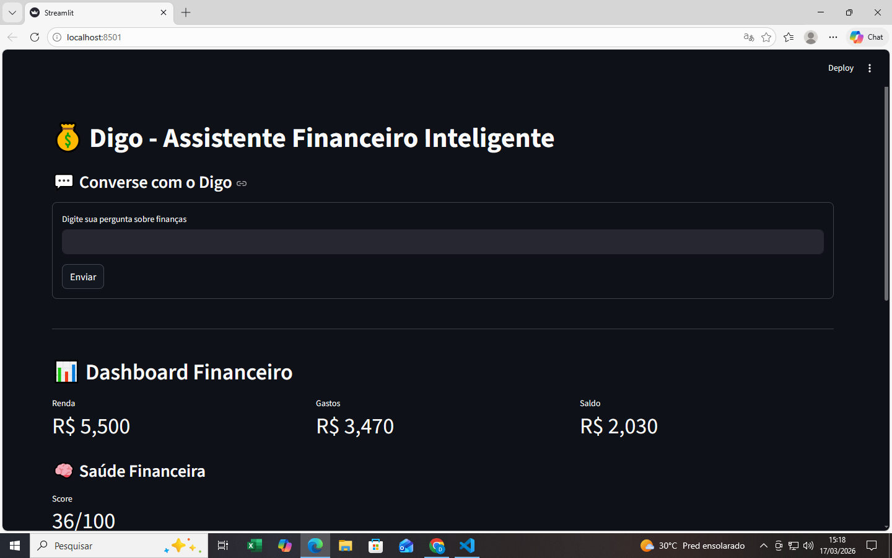
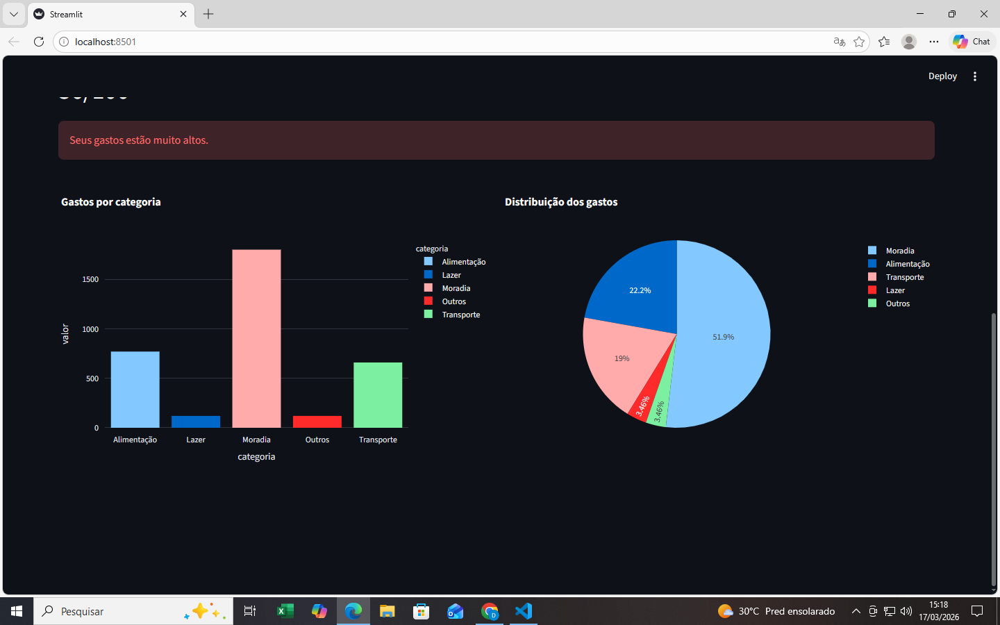
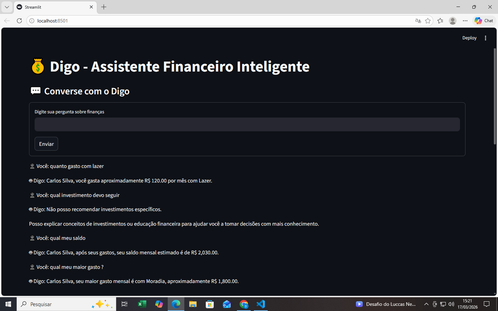

# 💰 Digo — Assistente Financeiro Inteligente

Projeto desenvolvido para o desafio de Agentes Inteligentes da DIO.

---

## 📌 Sobre o Projeto

O **Digo** é um agente financeiro inteligente que utiliza IA generativa para ajudar usuários a entender sua situação financeira, analisar gastos e aprender conceitos de educação financeira.

O sistema combina análise de dados com linguagem natural, permitindo que o usuário interaja por meio de um chat e receba respostas personalizadas com base em seus dados financeiros.

---

## 🚀 Funcionalidades

- 📊 Consulta de renda mensal  
- 📈 Análise de gastos por categoria  
- 💸 Identificação do maior gasto  
- 🧮 Cálculo de saldo mensal  
- 📚 Explicação de conceitos financeiros (CDB, CDI, Tesouro Selic)  
- 💬 Chat interativo com IA  
- 📊 Dashboard financeiro dinâmico  

---

## 📸 Evidências do Sistema

### 📊 Painel Financeiro



---

### 📈 Análise de Gastos



---

### 💬 Bate-papo com IA



---

## 🧠 Tecnologias Utilizadas

- Python  
- Streamlit  
- OpenAI API (GPT-4o-mini)  
- Pandas  
- JSON / CSV  

---

## 🛡️ Segurança e Confiabilidade

- O agente não recomenda investimentos específicos  
- Não acessa dados sensíveis (CPF, senhas, dados bancários)  
- Utiliza apenas dados da base de conhecimento  
- Possui regras para evitar alucinações  

---

## 📂 Estrutura do Projeto

```
data/        # Dados do cliente (JSON e CSV)
docs/        # Documentação do agente
logs/        # Registros de conversas (logs)
src/         # Código do agente
│   ├── agente.py
│   ├── analytics.py
│   ├── auditoria.py
│   └── agente_prompt.txt
app.py       # Interface Streamlit
```

---

## ▶️ Como Executar o Projeto

### 1. Clonar o repositório

```bash
git clone https://github.com/diegosantos1907/dio-lab-bia-do-futuro
```

### 2. Instalar dependências

```bash
pip install -r requirements.txt
```

### 3. Executar o sistema

```bash
streamlit run app.py
```

---

## 🎥 Demonstração

(Adicione aqui o link do seu vídeo pitch após gravar)

---

## 👨‍💻 Autor

Diego Santos
