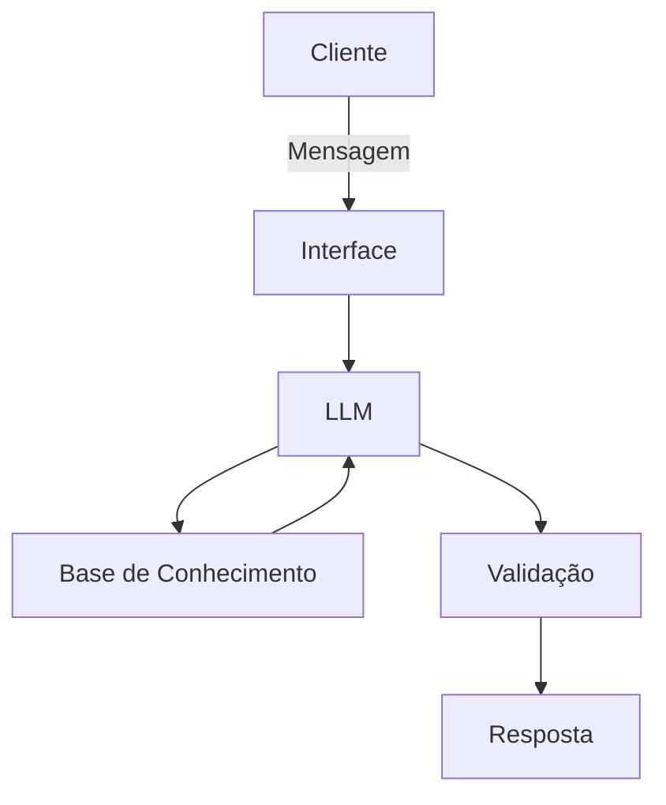

# Documentação do Agente

## Caso de Uso

### Problema
> Qual problema financeiro seu agente resolve?

[Muitas pessoas têm dificuldade em entender sua situação financeira mensal. 

Grande parte dos usuários não sabe exatamente quanto gasta por categoria, quanto sobra do salário ou como organizar melhor suas finanças pessoais.

Além disso, muitos usuários possuem pouco conhecimento sobre conceitos financeiros básicos como CDI, CDB e Tesouro Selic, o que dificulta a tomada de decisões financeiras mais conscientes.

O agente foi criado para ajudar o usuário a compreender melhor sua situação financeira, fornecendo informações sobre renda, gastos, saldo mensal e explicações educativas sobre conceitos financeiros.]

### Solução
> Como o agente resolve esse problema de forma proativa?

[O agente "Digo – Assistente Financeiro Inteligente" utiliza IA generativa combinada com uma base de dados financeira para ajudar o usuário a entender melhor sua situação financeira.

A solução funciona por meio de um chat interativo onde o usuário pode fazer perguntas sobre suas finanças pessoais.

O agente é capaz de analisar dados financeiros armazenados em arquivos estruturados (JSON e CSV) para responder perguntas como:

- Qual é a renda mensal do usuário
- Quanto o usuário gasta por categoria
- Quanto sobra do salário após os gastos
- Qual é o perfil de investidor do usuário

Além disso, o agente também explica conceitos financeiros importantes como CDI, CDB e Tesouro Selic, ajudando o usuário a desenvolver maior conhecimento em educação financeira.

O sistema também possui regras de segurança para evitar recomendações de investimento e proteger dados sensíveis, garantindo respostas responsáveis e confiáveis.]

### Público-Alvo
> Quem vai usar esse agente?

[O agente foi desenvolvido para pessoas que desejam entender melhor sua situação financeira e organizar suas finanças pessoais.

Ele é especialmente útil para usuários que desejam acompanhar seus gastos mensais, entender quanto sobra da renda e aprender conceitos básicos de educação financeira.

O agente também pode ser utilizado por pessoas que estão começando a se interessar por organização financeira e desejam aprender sobre produtos financeiros e conceitos como CDI, CDB e Tesouro Selic de forma simples e acessível.]

---

## Persona e Tom de Voz

### Nome do Agente
[Nome escolhido]

### Personalidade
> Como o agente se comporta? (ex: consultivo, direto, educativo)

[Sua descrição aqui]

### Tom de Comunicação
> Formal, informal, técnico, acessível?

[Sua descrição aqui]

### Exemplos de Linguagem
- Saudação: [ex: "Olá! Como posso ajudar com suas finanças hoje?"]
- Confirmação: [ex: "Entendi! Deixa eu verificar isso para você."]
- Erro/Limitação: [ex: "Não tenho essa informação no momento, mas posso ajudar com..."]

---

## Arquitetura

### Diagrama

### Componentes

| Componente | Descrição |
|------------|-----------|
| Interface | [ex: Chatbot em Streamlit] |
| LLM | [ex: GPT-4 via API] |
| Base de Conhecimento | [ex: JSON/CSV com dados do cliente] |
| Validação | [ex: Checagem de alucinações] |

---

## Segurança e Anti-Alucinação

### Estratégias Adotadas

- [ ] [ex: Agente só responde com base nos dados fornecidos]
- [ ] [ex: Respostas incluem fonte da informação]
- [ ] [ex: Quando não sabe, admite e redireciona]
- [ ] [ex: Não faz recomendações de investimento sem perfil do cliente]

### Limitações Declaradas
> O que o agente NÃO faz?

[Liste aqui as limitações explícitas do agente]
