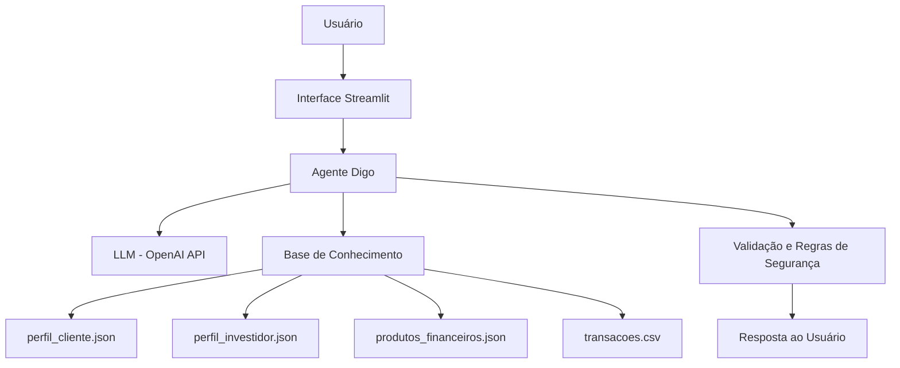

# Documentação do Agente

## Caso de Uso

### Problema
> Qual problema financeiro seu agente resolve?

Muitas pessoas têm dificuldade em entender sua situação financeira mensal. 

Grande parte dos usuários não sabe exatamente quanto gasta por categoria, quanto sobra do salário ou como organizar melhor suas finanças pessoais.

Além disso, muitos usuários possuem pouco conhecimento sobre conceitos financeiros básicos como CDI, CDB e Tesouro Selic, o que dificulta a tomada de decisões financeiras mais conscientes.

O agente foi criado para ajudar o usuário a compreender melhor sua situação financeira, fornecendo informações sobre renda, gastos, saldo mensal e explicações educativas sobre conceitos financeiros.

### Solução
> Como o agente resolve esse problema de forma proativa?

O agente "Digo – Assistente Financeiro Inteligente" utiliza IA generativa combinada com uma base de dados financeira para ajudar o usuário a entender melhor sua situação financeira.

A solução funciona por meio de um chat interativo onde o usuário pode fazer perguntas sobre suas finanças pessoais.

O agente é capaz de analisar dados financeiros armazenados em arquivos estruturados (JSON e CSV) para responder perguntas como:

- Qual é a renda mensal do usuário
- Quanto o usuário gasta por categoria
- Quanto sobra do salário após os gastos
- Qual é o perfil de investidor do usuário

Além disso, o agente também explica conceitos financeiros importantes como CDI, CDB e Tesouro Selic, ajudando o usuário a desenvolver maior conhecimento em educação financeira.

O sistema também possui regras de segurança para evitar recomendações de investimento e proteger dados sensíveis, garantindo respostas responsáveis e confiáveis.

### Público-Alvo
> Quem vai usar esse agente?

O agente foi desenvolvido para pessoas que desejam entender melhor sua situação financeira e organizar suas finanças pessoais.

Ele é especialmente útil para usuários que desejam acompanhar seus gastos mensais, entender quanto sobra da renda e aprender conceitos básicos de educação financeira.

O agente também pode ser utilizado por pessoas que estão começando a se interessar por organização financeira e desejam aprender sobre produtos financeiros e conceitos como CDI, CDB e Tesouro Selic de forma simples e acessível.

---

## Persona e Tom de Voz

### Nome do Agente
[Digo – Assistente Financeiro Inteligente]

### Personalidade
> Como o agente se comporta? (ex: consultivo, direto, educativo)

O agente possui uma personalidade educativa, consultiva e objetiva.

Ele foi projetado para ajudar o usuário a compreender melhor sua situação financeira, explicando conceitos de educação financeira de forma clara e acessível.

O agente busca orientar o usuário na compreensão de seus gastos, renda e organização financeira, sempre mantendo uma postura responsável e evitando recomendações diretas de investimento.

### Tom de Comunicação
> Formal, informal, técnico, acessível?

O agente utiliza um tom de comunicação amigável, claro e educativo.

As respostas são apresentadas de forma simples e didática, evitando termos técnicos complexos sempre que possível. O objetivo é tornar conceitos financeiros mais fáceis de entender para qualquer usuário.

### Exemplos de Linguagem
- Saudação: - Saudação: "Olá! Como posso ajudar você com suas finanças hoje?"
- Confirmação: - Confirmação: "Entendi! Vou verificar suas informações financeiras para responder sua pergunta."
- Erro/Limitação: - Erro/Limitação: "Não posso recomendar investimentos específicos, mas posso explicar conceitos financeiros que podem ajudar na sua decisão."

---

## Arquitetura

### Diagrama

### Componentes

| Componente | Descrição |
|------------|-----------|
| Interface | Chat interativo desenvolvido em Streamlit onde o usuário faz perguntas sobre suas finanças |
| LLM | Modelo GPT-4o-mini acessado através da API da OpenAI para gerar respostas inteligentes |
| Base de Conhecimento | Arquivos JSON e CSV contendo dados do cliente, perfil de investidor, produtos financeiros e transações |
| Validação | Regras de segurança e auditoria de respostas para evitar alucinações e recomendações de investimentos |

## Segurança e Anti-Alucinação

### Estratégias Adotadas

- O agente responde apenas com base nos dados presentes na base de conhecimento (arquivos JSON e CSV).
- Informações financeiras como gastos e renda são calculadas diretamente a partir dos dados fornecidos, evitando respostas inventadas pela IA.
- Quando uma pergunta está fora do escopo de educação financeira, o agente informa sua limitação e redireciona a conversa para o tema correto.
- O agente não recomenda investimentos específicos e mantém uma postura educativa ao explicar conceitos financeiros.
- Dados sensíveis como CPF, senha ou informações bancárias não são acessados nem exibidos pelo agente.

### Limitações Declaradas

O agente possui algumas limitações importantes:

- Não realiza recomendações de investimentos específicos.
- Não acessa contas bancárias reais ou dados financeiros externos.
- Não executa operações financeiras como pagamentos ou transferências.
- Não substitui a orientação de um consultor financeiro profissional.
- Não faz previsões de mercado financeiro ou recomendações baseadas em especulação.

## Diferenciais do Agente

O agente **Digo – Assistente Financeiro Inteligente** foi desenvolvido com foco em fornecer respostas seguras, contextualizadas e baseadas em dados reais do usuário. Seus principais diferenciais são:

### 📊 Uso de dados reais do cliente
O agente utiliza informações como renda, perfil de investidor e histórico de transações para gerar respostas personalizadas e relevantes.

### 📈 Análise financeira automatizada
O agente é capaz de calcular gastos totais, identificar o maior gasto mensal, analisar despesas por categoria e estimar o saldo disponível com base nos dados fornecidos.

### 🔄 Atualização dinâmica dos dados
A base de conhecimento é recarregada a cada interação, garantindo que as respostas estejam sempre atualizadas de acordo com os dados mais recentes.

### 💬 Uso de histórico de conversa
O agente considera interações anteriores no chat para manter o contexto da conversa, proporcionando respostas mais coerentes e contínuas ao longo do diálogo.

### 📊 Dashboard dinâmico interativo
O sistema possui uma interface em Streamlit que exibe informações financeiras de forma visual, como gráficos de gastos e resumo financeiro, permitindo uma melhor compreensão da situação do usuário.

### 🛡️ Guardrails de segurança
O agente possui regras que impedem recomendações financeiras específicas e o acesso a dados sensíveis, garantindo um comportamento seguro e responsável.

### 📚 Foco em educação financeira
O agente não apenas responde perguntas, mas também explica conceitos financeiros de forma clara, acessível e educativa.

### ⚠️ Tratamento de exceções (edge cases)
O agente responde corretamente a perguntas fora do escopo e solicitações inadequadas, mantendo consistência e confiabilidade.

---

Esses diferenciais tornam o **Digo** um assistente financeiro inteligente, confiável e capaz de apoiar usuários na organização e compreensão de suas finanças pessoais.
